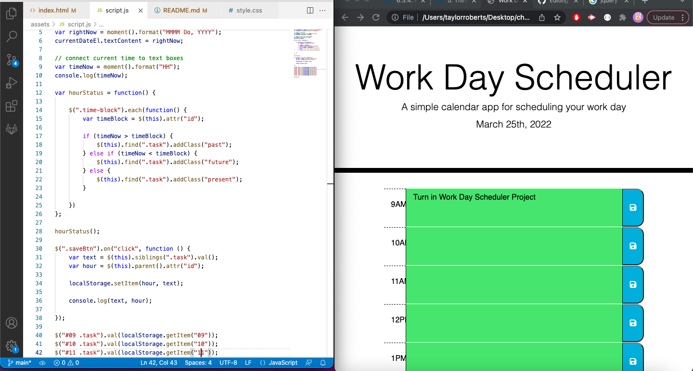

# Work Day Scheduler

## Motivation

- My motivation for this project was to make a daily planner for working hours to better organize your day. This project also shows text areas in different colors that represent past, present and future times to help give the user a sense of urgency for tasks pending completion.

## Problems

- I struggled quite a bit with using jQuery an dhad to look through a lot of documentation and questions and answers from Stack Overflow to get a handle on this project. I tried to use jQuery rather than JavaScript because I wanted to try to push myself to learn it better.

# What I Learned

- In this project I finally learned how to create data persistence. It took a grueling seven hours of work to figure it out but I finally got it sorted. I'm hoping to work more with data persistence to hone my skills with jQuery.

### Click [here](https://taystarr.github.io/workday-scheduler/) to use my Work Day Scheduler!